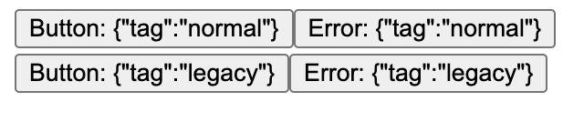

# React 18: Automatic Batching

URL: https://mizunashi-mana.github.io/react18-legacy-render-try/

`ReactDOM.render` vs `ReactDOM.createRoot(...).render`

## TL;DR

```javascript
import React from 'react';
import LegacyReactDOM from 'react-dom';

let i = 0;

const App = () => {
    const [state, setState] = React.useState(0);
    i++;

    React.onEffect(() => {
        setTimeout(() => {
            setState(1);
            setState(2);
        }, 1);
    }, []);

    return <div>{i}</div>;
};

LegacyReactDOM.render(<App />, document.getElementById('root'));
```

is equal to

```javascript
import React from 'react';
import ReactDOM from 'react-dom/client';
import LegacyReactDOM from 'react-dom';

let i = 0;

const App = () => {
    const [state, setState] = React.useState(0);
    i++;

    React.onEffect(() => {
        setTimeout(() => {
            LegacyReactDOM.flushSync(() => {
                setState(1);
            });
            LegacyReactDOM.flushSync(() => {
                setState(2);
            });
        }, 1);
    }, []);

    return <div>{i}</div>;
};

ReactDOM.createRoot(document.getElementById('root')).render(<App />);
```

, but not equal to

```javascript
import React from 'react';
import ReactDOM from 'react-dom/client';

let i = 0;

const App = () => {
    const [state, setState] = React.useState(0);
    i++;

    React.onEffect(() => {
        setTimeout(() => {
            setState(1);
            setState(2);
        }, 1);
    }, []);

    return <div>{i}</div>;
};

ReactDOM.createRoot(document.getElementById('root')).render(<App />);
```

## How to start

```
npm install
npm run start
```

then, open the page on browser automatically such as:



## Case.1: click `Button: {"tag":"normal"}`

```
index.js:13 legacy render
index.js:13 legacy componentDidMount
index.js:13 normal render
index.js:13 normal componentDidMount
index.js:13 normal onClick
index.js:13 normal onClick finish
index.js:13 normal onClick async 1
index.js:13 normal onClick async 2
index.js:13 normal onClick async finish
index.js:13 normal render
index.js:13 normal componentDidUpdate
index.js:13 normal setState callback 1
index.js:13 normal setState callback 2
```

## Case.2: click `Button: {"tag":"legacy"}`

```
index.js:13 legacy render
index.js:13 legacy componentDidMount
index.js:13 normal render
index.js:13 normal componentDidMount
index.js:13 legacy onClick
index.js:13 legacy onClick finish
index.js:13 legacy onClick async 1
index.js:13 legacy render
index.js:13 legacy componentDidUpdate
index.js:13 legacy setState callback 1
index.js:13 legacy onClick async 2
index.js:13 legacy render
index.js:13 legacy componentDidUpdate
index.js:13 legacy setState callback 2
index.js:13 legacy onClick async finish
```
